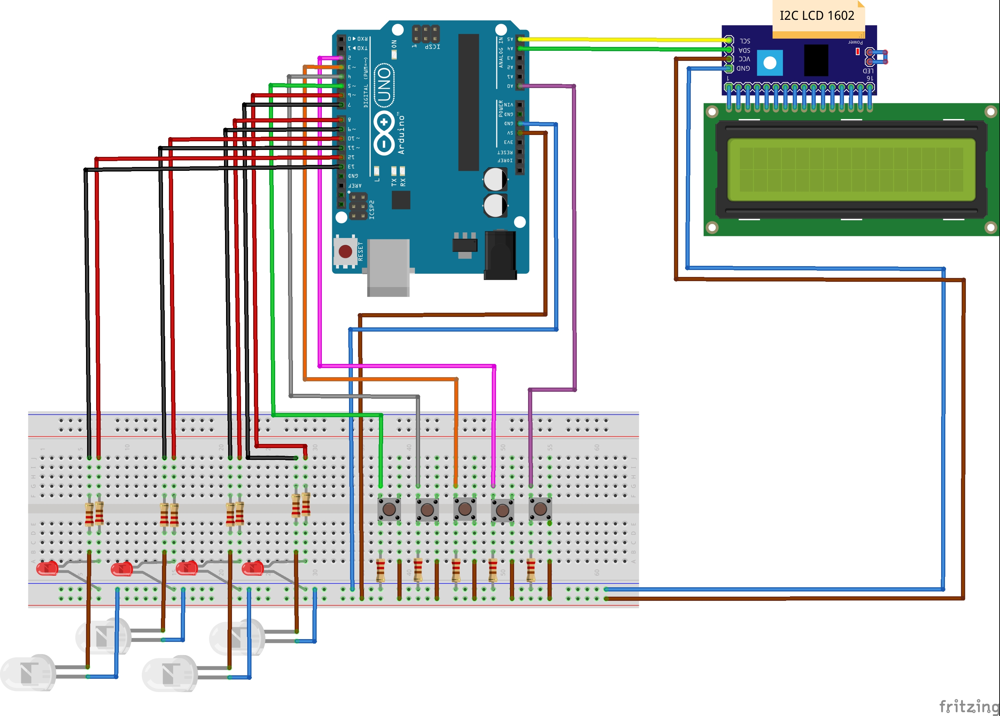

# </>Mastermind 🐧
School assignment with Arduino Uno 3

on

Technical University of Košice 
Faculty of Electrical Engineering and Informatics 
Study program: Intelligent Systems 

/* Main game functionality is in mastermind.cpp */

# How it's played 🕹️

You have to guess 4 digit number to win. You have 10 tries. 
Set your guess with 4 buttons and then after pressing ENTER button,
the Arduino finds out how many digits you have guessed right
on the right position and how many on the wrong position.

# Wiring diagram

# If you want to cheat

If you want to cheat the winning, head to Arduino IDE, on Windows
press `Ctrl + Shift + M` to open Serial Monitor and there will be the
secret 4 digit code displayed (To see this you have to pass
through the "Press ENTER to start new game!").
